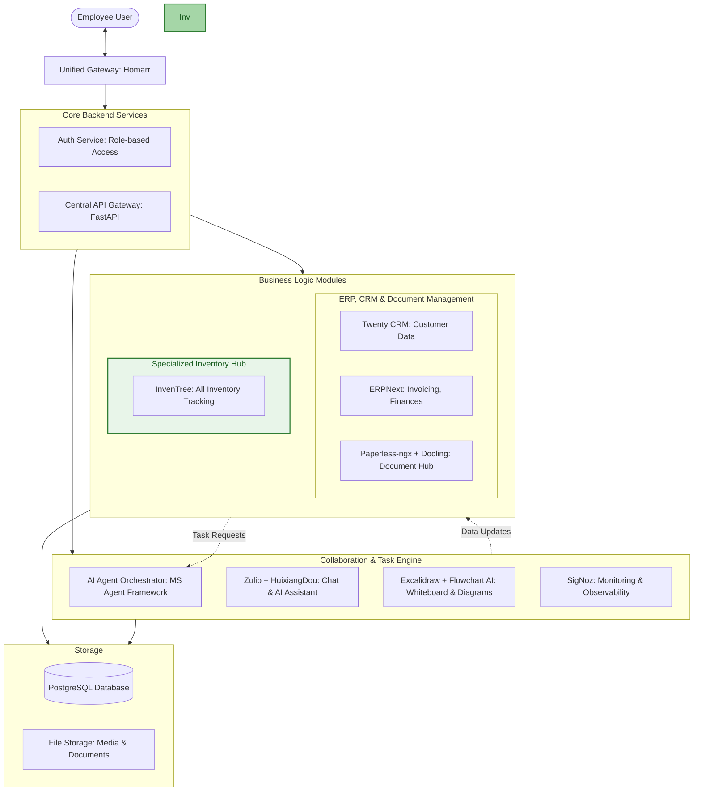

# Mine System: Enterprise Integration Platform

## Project Overview

**Vision**: Build a unified enterprise platform integrating specialized tools for inventory management, ERP, CRM, document handling, AI orchestration, and collaboration.

**Core Stack**:
- 🧠 **Intelligence & Inventory**: Microsoft Agent Framework + InvenTree
- 🧾 **ERP for Financials**: ERPNext
- 🤝 **CRM for Customer Data**: Twenty CRM
- 🤖 **Automation Layer**: Microsoft Agent Framework
- 📄 **Document Hub**: Paperless-ngx + IBM Docling
- 🤝 **Gateway & Collaboration**: Caddy + FastAPI API Gateway, Homarr, Zulip, SigNoz, Excalidraw + Flowchart AI, HuixiangDou

---

## Team Structure (Elite Squad)

### Leadership
| Role | Name | Focus |
|------|------|-------|
| Lead Developer & Project Manager | @Lead | Overall architecture, coordination |
| System Architect | @Architect | Clean architecture, data flow |

### Team Alpha: Core Infrastructure (Phase 1)
| Skill Source | Responsibility |
|-------------|----------------|
| @gstack-main (review) | Security, API contracts |
| @Devine Brain (microservices) | Container orchestration, Caddy proxy |
| @RUFLO (autopilot) | Automation scripts, monitoring |

**Tasks**: Homarr setup, Caddy reverse proxy, PostgreSQL databases, SigNoz observability

### Team Beta: Business Systems (Phase 2)
| Skill Source | Responsibility |
|-------------|----------------|
| @elit dev Skills (code_refactor) | ERPNext deployment, customization |
| @Devine Brain (bulletproof-react) | Twenty CRM frontend integration |
| @RUFLO (intelligence) | InvenTree configuration |

**Tasks**: ERPNext, Twenty CRM, InvenTree, Paperless-ngx deployment

### Team Gamma: Integration Layer (Phase 3)
| Skill Source | Responsibility |
|-------------|----------------|
| @RUFLO (workflows) | FastAPI Gateway, webhook system |
| @gstack-main (investigate) | API sync logic, data pipelines |
| @RUFLO (browser) | AI Agent integration |

**Tasks**: FastAPI Gateway, webhook events, API sync, Microsoft Agent Framework

### Team Delta: User Experience (Phase 4)
| Skill Source | Responsibility |
|-------------|----------------|
| @Devine Brain (query) | Dashboard widgets, data queries |
| @gstack-main (context-save) | State management, sessions |
| @elit dev Skills (plan_sequential) | UX flow implementation |

**Tasks**: Homarr unified dashboard, Zulip ChatOps, Excalidraw integration

---

## Architecture

---

## Phased Rollout Plan

### Phase 1: The Backbone (Weeks 1-2)
**Team**: Alpha | **Files**: `plans/1-core-infra/`

1. **Proxy & Dashboard**
   - Setup Caddy reverse proxy configuration
   - Deploy Homarr unified dashboard
   - Configure SSL/TLS certificates

2. **Database Infrastructure**
   - Deploy dedicated PostgreSQL for InvenTree
   - Configure connection pooling
   - Setup backup strategy

3. **Observability Stack**
   - Deploy SigNoz for monitoring
   - Configure log aggregation
   - Setup alerting rules

### Phase 2: Business Systems (Weeks 3-5)
**Team**: Beta | **Files**: `plans/2-business-systems/`

1. **ERP & CRM Deployment**
   - Deploy ERPNext (invoicing, finances)
   - Deploy Twenty CRM (customer data)
   - Configure integrations

2. **Inventory Management**
   - Deploy InvenTree via docker-compose
   - Configure environment (.env)
   - Run initial database setup: `docker compose run --rm inventree-server invoke update`

3. **Document Hub**
   - Deploy Paperless-ngx
   - Configure IBM Docling OCR
   - Setup document storage

### Phase 3: Integration Layer (Weeks 6-8)
**Team**: Gamma | **Files**: `plans/3-integration/`

1. **FastAPI Gateway**
   - Build Central API Gateway
   - Implement authentication (role-based access)
   - Create service endpoints

2. **Webhook Event System**
   - Configure InvenTree EventMixin
   - Build webhook handlers
   - Create event queue

3. **API Sync Logic**
   - InvenTree ↔ ERPNext: Purchase orders
   - Twenty CRM ↔ InvenTree: Stock reservations
   - Bi-directional sync rules

4. **AI Agent Integration**
   - Connect Microsoft Agent Framework
   - Implement automation tasks
   - Configure permissions

### Phase 4: Unified User Experience (Weeks 9-10)
**Team**: Delta | **Files**: `plans/4-ux/`

1. **Unified Dashboard**
   - Create Homarr app tiles
   - Custom widget development
   - Theme integration

2. **ChatOps**
   - Deploy Zulip
   - Integrate HuixiangDou AI
   - Configure bot commands

3. **Visual Collaboration**
   - Embed Excalidraw
   - Integrate Flowchart AI
   - Workflow diagram templates

---

## Responsibilities Matrix

| Component | Owner | Skills Used |
|-----------|-------|-------------|
| Caddy Proxy | @gstack-main (review) | Security, API contracts |
| Homarr Dashboard | @Devine Brain (query) | Query, state management |
| PostgreSQL | @Devine Brain (microservices) | Terraform, infrastructure |
| SigNoz | @RUFLO (autopilot) | Automation, monitoring |
| ERPNext | @elit dev Skills (code_refactor) | Code refactoring |
| Twenty CRM | @Devine Brain (bulletproof-react) | React, frontend |
| InvenTree | @RUFLO (intelligence) | SDK, Python |
| Paperless-ngx | @RUFLO (workflows) | Workflow automation |
| FastAPI Gateway | @RUFLO (workflows) | API development |
| Webhooks | @gstack-main (investigate) | Investigation, debugging |
| AI Agents | @RUFLO (browser) | Browser automation |
| Zulip/HuixiangDou | @elit dev Skills (plan_sequential) | Sequential planning |
| Excalidraw | @gstack-main (context-save) | State management |

---

## Available Projects in Workspace

| Project | Location | Purpose |
|---------|----------|---------|
| InvenTree-master | `E:\Mine System\InvenTree-master` | Inventory tracking |
| HuixiangDou-main | `E:\Mine System\HuixiangDou-main` | AI assistant |
| twenty-main | `E:\Mine System\twenty-main` | CRM |
| excalidraw-master | `E:\Mine System\excalidraw-master` | Whiteboard |
| flowchart-ai-main | `E:\Mine System\flowchart-ai-main` | Diagram AI |

---

## Next Steps

1. **Week 1**: Start with Team Alpha - deploy Caddy, Homarr, PostgreSQL
2. **Focus first**: Get data flowing between InvenTree + ERPNext
3. **SDK usage**: Use `inventree-sdk` and `inventree` Python module
4. **Verify**: Run lint/typecheck before commit (to be defined)

---

*Plan Version: 1.0* | *Created: 2026-05-03* | *Status: Planning Phase Only*